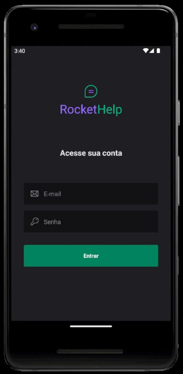

# RocketHelp-React-Native
Aplicativo de abertura de chamados para empresas desenvolvido no evento Ignite Lab.

Typescript, Firebase, React Native, Native Base, auth, useState, useEffects.

  
  
  
